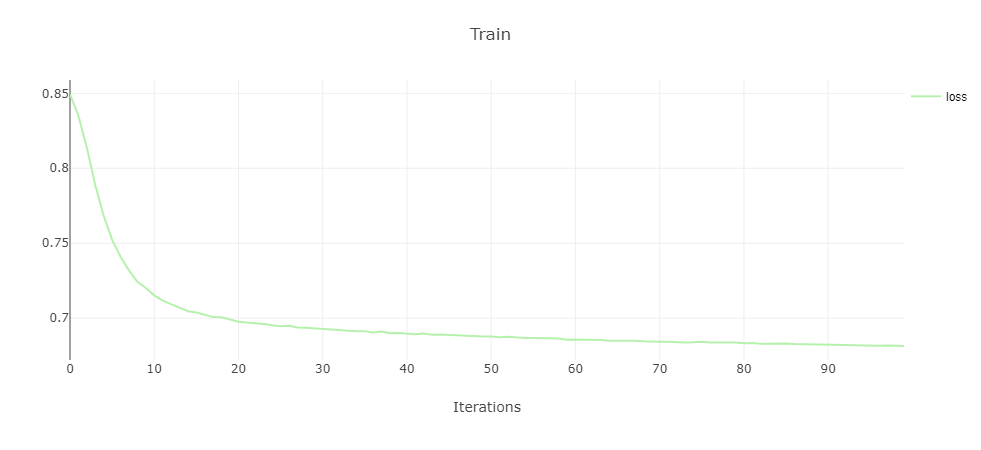
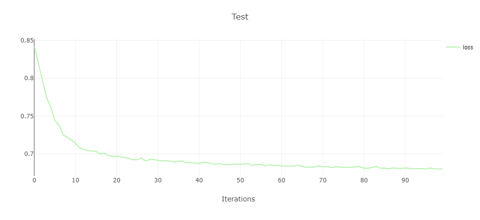
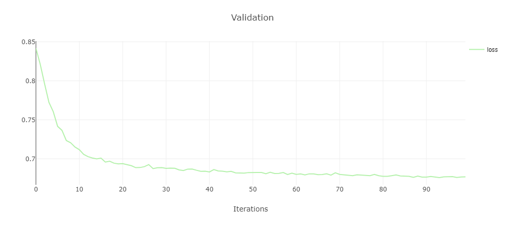
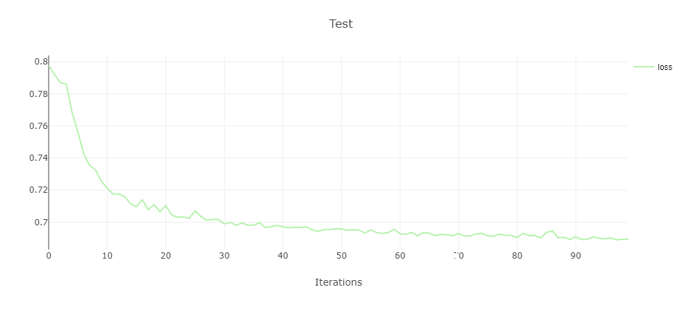
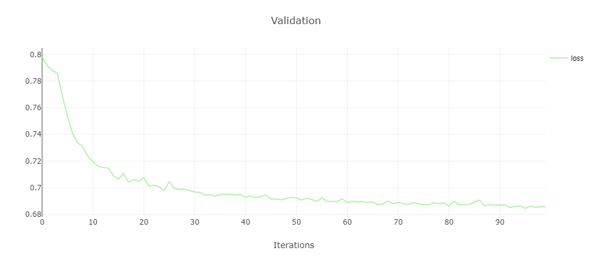
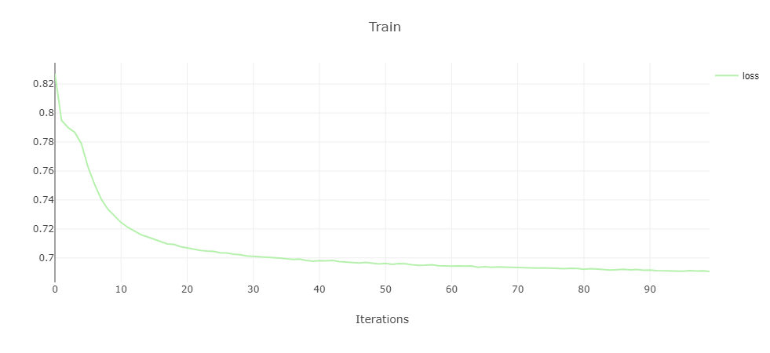
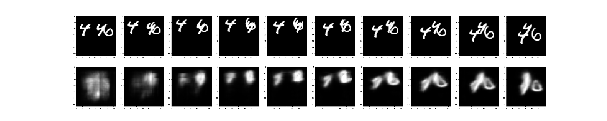
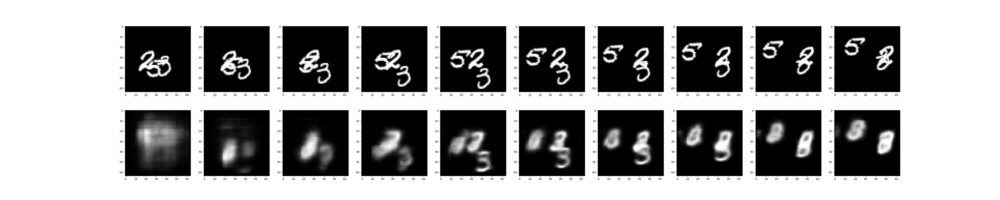

# ConvLSTM.pytorch


## LiteML README

The conv lstm block was adapted from: https://github.com/ndrplz/ConvLSTM_pytorch

To run the example type:
```
python main.py --name 3x3_16_3x3_32_3x3_64 --qat true --to_onnx false
```

| Float (Dice loss) | 8 bit PTQ (dice loss) | 8 bit QAT (Dice Loss) |
|-------------------| --------------------- | --------------------- |
| 0.682             | 0.79                  | 0.68                  |

Note, this model requires custom tracer. for more details about custom tracers see LiteML documentation.

### Command line arguments
--to_onnx: boolean, set to export the model to onnx file

--qat: boolean do quantization aware training


The original model is wrapped in Retrainer model in following way:
```
        cfg = RetrainerConfig("./liteml_config.yaml", custom_tracer = CustomTracer1)
        cfg["QAT"]['calibration_loader'] = valid_loader
        cfg["QAT"]['calibration_loader_key'] = key
        model = RetrainerModel(model, cfg)
        model.initialize_quantizers(valid_loader, key=key)
        model = model.to(config.device)
```


### Vanilla loss plots






### QAT 8 bit retraining loss plots






## Repo README

This repository is an unofficial pytorch implementation of 
[Convolutional LSTM Network: A Machine Learning Approach for Precipitation Nowcasting](https://arxiv.org/abs/1506.04214v1).
We reimplement the experiments in the paper based on the MovingMNIST dataset, which is followed by [Github](https://github.com/jhhuang96/ConvLSTM-PyTorch).
Detailed understanding is available on my [Blog](https://www.cnblogs.com/CZiFan/p/12630949.html).

## Requirements
- Pytorch>=0.4.0
- CPU or GPU
- Other packages can be installed with the following instruction:
```
pip install requirements.txt
```
  
## Quick start
Running the code with the following command, and the '--config' parameter represents different network architectures.
```
python main.py --config 3x3_16_3x3_32_3x3_64 --qat True
```

## Results
| Model | Parameters(M) | Flops(G) | DiceLoss |
|---|---|---|---|
| 3x3_16_3x3_32_3x3_64 | 0.61 | 9.19 | 0.682311 | 
| 3x3_32_3x3_64_3x3_128 | 2.45 | 36.35 | 0.665905 |
* Note: In order to reduce the number of parameters and flops, 
we did not strictly follow the model architecture in the paper, but modified it into unet style structure.


## Citation

```
@inproceedings{xingjian2015convolutional,
  title={Convolutional LSTM network: A machine learning approach for precipitation nowcasting},
  author={Xingjian, SHI and Chen, Zhourong and Wang, Hao and Yeung, Dit-Yan and Wong, Wai-Kin and Woo, Wang-chun},
  booktitle={Advances in neural information processing systems},
  pages={802--810},
  year={2015}
}
```
